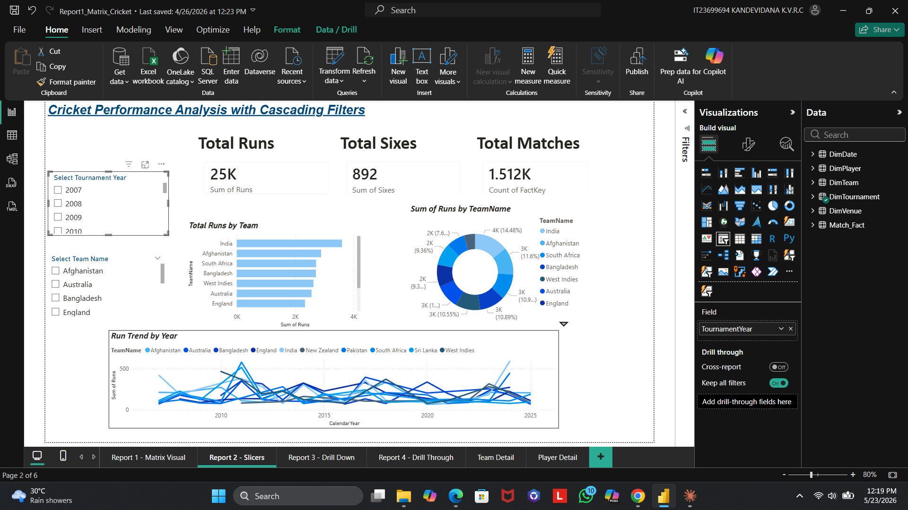
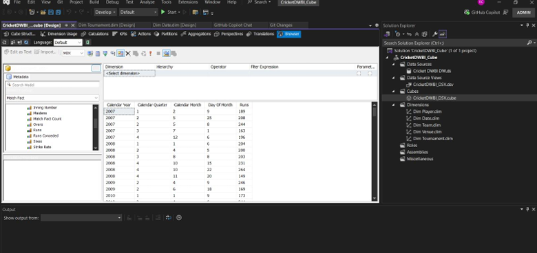
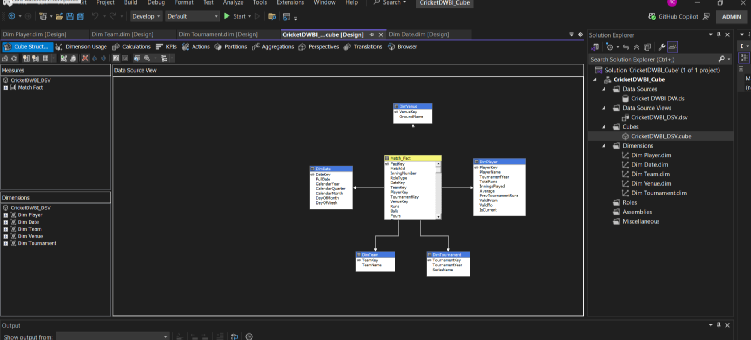

# 🏏 T20 World Cup Cricket Data Warehouse & BI Analytics

> End-to-end Data Warehousing and Business Intelligence solution  
> built on the ICC Men's T20 World Cup dataset (2007–2022)
>
> 📚 Academic project — IT3021 Data Warehousing & Business Intelligence | SLIIT 2026

---

## 🧠 Overview

This project implements a full **three-layer data warehousing architecture**:

```
CSV Files + SQL Server (Source)
          ↓
🧹 Staging Layer → 8 staging tables
          ↓
🔄 ETL Pipeline → 3 SSIS packages
          ↓
⭐ Star Schema Data Warehouse
          ↓
📊 SSAS OLAP Cube + Power BI Reports
```

---

## 📁 Project Structure

| File | Description |
|------|-------------|
| `DWBI_Assignment01_IT23699694.pdf` | Assignment 1 — DW Design & ETL Pipeline |
| `Assignment2_IT23699694_1.pdf` | Assignment 2 — OLAP Cube & Power BI Reports |
| `Load_Staging.dtsx` | SSIS Package 1 — Extract all sources to staging |
| `Load_DW.dtsx` | SSIS Package 2 — Transform & load Star Schema |
| `Update_Accumulating_Fact.dtsx` | SSIS Package 3 — Accumulating snapshot updates |
| `OLAP_Operations_CricketCube.xlsx` | Excel OLAP operations demo |

---

## ⭐ Data Warehouse Design

**Schema:** Star Schema  
**Fact Table:** `Match_Fact` — 1,512 rows (1,440 BAT + 72 BOWL)

| Dimension | Type | Rows | Description |
|-----------|------|------|-------------|
| DimDate | Date Dimension | 11,323 | Calendar spine 2000–2030 |
| DimPlayer | SCD Type 2 | 1,538 | Player history tracking |
| DimTeam | SCD Type 1 | 10 | T20 World Cup teams |
| DimTournament | SCD Type 1 | 18 | Tournament editions |
| DimVenue | SCD Type 1 | 10 | Match venues |

---

## 🔄 ETL Pipeline — All Verified ✅

| Table | Expected | Actual | Status |
|-------|----------|--------|--------|
| DimTeam | 10 | 10 | ✅ PASS |
| DimTournament | 18 | 18 | ✅ PASS |
| DimPlayer | 1,538 | 1,538 | ✅ PASS |
| Match_Fact Total | 1,512 | 1,512 | ✅ PASS |

---

## 📊 OLAP Operations (Excel + SSAS)

| Operation | Description |
|-----------|-------------|
| 🔼 Roll-Up | Aggregate from Day → Year level |
| 🔽 Drill-Down | Year → Quarter → Month → Team |
| 🍕 Slice | Filter by single team (e.g. Afghanistan) |
| 🎲 Dice | Multiple filters (Team + Tournament) |
| 🔄 Pivot | Swap rows/columns for new perspective |

---

## 📈 Power BI Reports

- **Report 1:** Matrix Visual — Cricket Performance by Team & Year  
- **Report 2:** Cascading Slicers with Bar, Line & Donut charts  
- **Report 3:** Drill-Down by Time Hierarchy (Year → Day)  
- **Report 4:** Drill-Through (Team Detail & Player Detail pages)  

---

## 📸 Screenshots

### Power BI Dashboard


### SSAS Cube Browser


### Star Schema


---

## 🛠️ Tools & Technologies


- **Database:** SQL Server 2022  
- **ETL:** SSIS (SQL Server Integration Services)  
- **OLAP:** SSAS Multidimensional Cube  
- **Reporting:** Power BI Desktop + Power BI Service  
- **Analysis:** Excel PivotTables connected live to SSAS  

---

## 📁 Dataset

[🔗 Cricket World Cup T20 Dataset — Kaggle](https://www.kaggle.com/datasets/samyakrajbayar/cricket-world-cup-t20-dataset)

- 18 T20 World Cup editions (2007–2022)  
- 10 teams · 1,538 players · 10 venues  

---

## 💡 Key Takeaway

> *"A complete end-to-end BI solution — from raw CSV files to interactive  
> Power BI dashboards — built from scratch using industry-standard  
> data warehousing patterns."*
